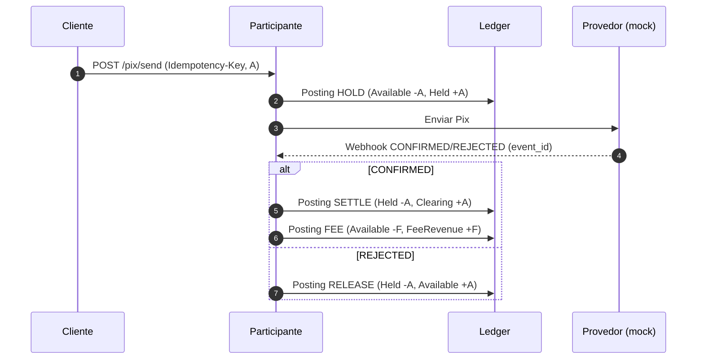

# fintech-challenge : Envio de Pix (Mock do Provedor)

Este repositório entrega **um mock de provedor Pix** (simulador) + contratos (OpenAPI) para padronizar uma fintech-challenge focada em **resiliência, idempotência, deduplicação e reconciliação**.

A proposta: cada time implementa um serviço "participante" que expõe uma API mínima (`/pix/send`, `/webhooks/pix`, etc.) e conversa com o mock do provedor.

## O que tem aqui
- `mock-provider/`: mock do provedor Pix (HTTP) com caos (timeout, 5xx, duplicidade e fora de ordem)
- `contracts/participant-openapi.yaml`: contrato que cada time deve implementar
- `contracts/provider-openapi.yaml`: contrato do mock do provedor
- `docker-compose.yml`: sobe o mock localmente

---

## Rodando local (mock do provedor)
### Pré-requisitos
- Docker + Docker Compose

### Subir o mock
```bash
cd pix-fintech-challenge
docker compose up --build
```

O mock fica em:
- Base URL: `http://localhost:8080`
- Health: `GET http://localhost:8080/health`

### Configurar o webhook do participante
O mock envia eventos para `WEBHOOK_URL` (definido no `docker-compose.yml`). Por padrão:
- `http://host.docker.internal:8081/webhooks/pix`

Ou seja, seu serviço participante precisa estar rodando localmente na porta `8081` e expor `POST /webhooks/pix`.

No Linux, se `host.docker.internal` não resolver, você pode:
- trocar `WEBHOOK_URL` pelo seu IP local, ou
- usar `network_mode: host` no serviço do mock (mais simples, mas muda o isolamento).

---

## Como o participante deve funcionar (regras do jogo)
O participante recebe a intenção de envio do cliente e processa em background:
- `POST /pix/send` **idempotente** (header `Idempotency-Key`)
- Persistir estado + auditoria
- Enviar para o provedor (mock)
- Fechar o estado final ao receber webhook (dedup por `event_id`)
- Ter reconciliação para pendências (consulta no provedor)

Contrato completo do participante:
- veja `contracts/participant-openapi.yaml`

---

## Chamando o mock do provedor
### 1) Iniciar envio no provedor (simulado)
```bash
curl -sS -X POST http://localhost:8080/provider/pix/send \
  -H 'Content-Type: application/json' \
  -H 'X-Correlation-Id: demo-123' \
  -d '{
    "idempotency_key": "idem-001",
    "txid": "tx-001",
    "amount": 1500,
    "receiver_key": "chave@pix",
    "description": "teste",
    "client_reference": "ref-001"
  }' | jq
```

O mock responde `202` com um `provider_payment_id`.

### 2) Consultar status no provedor (simulado)
```bash
curl -sS http://localhost:8080/provider/pix/payments/<provider_payment_id> | jq
```

---

## Caos e cenários de falha
Você pode forçar um cenário por request com o header `X-Mock-Scenario`:
- `success` → responde 202 e confirma via webhook
- `timeout_then_confirm` → simula timeout, mas confirma depois via webhook
- `timeout_then_reject` → simula timeout, mas rejeita depois via webhook
- `http500` → responde 500
- `accept_then_confirm` → responde 202 e confirma via webhook
- `accept_then_reject` → responde 202 e rejeita via webhook

Obs.: envio de eventos fora de ordem e duplicados é controlado por probabilidade via variáveis `P_OUT_OF_ORDER_EVENT` e `P_DUPLICATE_EVENT`.

Exemplo (forçando timeout):
```bash
curl -i -X POST http://localhost:8080/provider/pix/send \
  -H 'Content-Type: application/json' \
  -H 'X-Mock-Scenario: timeout_then_confirm' \
  -d '{"idempotency_key":"idem-002","txid":"tx-002","amount":1200,"receiver_key":"k"}'
```

### Modo probabilístico (default no compose)
Variáveis (ver `docker-compose.yml`):
- `P_TIMEOUT`, `P_HTTP500`, `P_DUPLICATE_EVENT`, `P_OUT_OF_ORDER_EVENT`
- `MIN_LATENCY_MS`, `MAX_LATENCY_MS`
- `FINALIZE_MIN_MS`, `FINALIZE_MAX_MS`

---

## Dica de checklist para o participante
- Idempotência: mesma `Idempotency-Key` → mesmo `payment_id` e sem duplicar envio
- Outbox/inbox (ou equivalente) para garantir entrega e reprocessamento
- Dedup webhook por `event_id`
- Máquina de estados com transições válidas (não regredir estado terminal)
- Retry com backoff + jitter e circuit breaker
- Timeouts definidos
- Observabilidade: logs estruturados, métricas, correlation-id, tracing
- Reconciliar pendências via consulta no provedor

---

## Teste simples (bash)
Um teste básico para validar idempotência, latência e reconciliação do participante.

Pré-requisitos:
- Mock do provedor rodando em `http://localhost:8080`
- Participante rodando em `http://localhost:8081`

Rodar o teste:
```bash
bash scripts/simple-test.sh
```

Variáveis úteis:
- `PARTICIPANT_URL` (default: `http://localhost:8081`)
- `WARMUP_SECONDS` (default: 20)
- `TEST_SECONDS` (default: 120)
- `RPS` (default: 5)
- `DUPLICATE_PERCENT` (default: 10)
- `MAX_POLL_SECONDS` (default: 20)

O script gera um relatório JSON em `reports/` com métricas básicas.

---

## Regras da competição e pontuação
### Objetivo
Construir um serviço resiliente que processe envios Pix com **idempotência**, **deduplicação**, **reconciliação** e **consistência final** dos estados.

### Duração e carga
- Janela de execução: 10 a 20 minutos.
- Carga variável com picos (ex.: 50–500 RPS).
- Mix de cenários com erros e eventos fora de ordem (via mock).

### Regras obrigatórias
- `POST /pix/send` idempotente (mesma `Idempotency-Key` → mesma resposta e sem duplicar envio).
- Deduplicação de webhooks por `event_id`.
- Estado final deve ser **CONFIRMED** ou **REJECTED** (sem regressão).
- Reconciliar pendências via consulta ao provedor.
- Não duplicar débito (um pagamento não pode liquidar duas vezes).

### Limites
- CPU e memória limitadas (definir no compose ou na infraestrutura).
- Timeouts de rede devem ser respeitados.
- Sem dependência de serviços externos não especificados.

### Métricas coletadas
- Taxa de sucesso (processos completos).
- Latência p95/p99 de `POST /pix/send`.
- Consistência final dos estados (sem divergências).
- Tolerância a falhas (retries sem duplicidade).

### Penalidades
- Pagamento liquidado mais de uma vez.
- Status divergente entre `GET /pix/payments` e base interna.
- Perda de evento ou estado “preso” indefinidamente.

### Pontuação (exemplo)
Pontuação normalizada entre 0 e 100:

$$
score = 100 \cdot \max\left(0, 0.55 \cdot S - 0.25 \cdot E - 0.20 \cdot L\right)
$$

Onde:
- $S$ = taxa de sucesso (0–1)
- $E$ = taxa de erros graves (0–1)
- $L$ = penalidade de latência (0–1), baseada em p95/p99

### Reprodutibilidade
- Semente fixa para o gerador de cenários.
- Relatório final com métricas + logs mínimos.

### Entregáveis
- Serviço participante executável.
- Instruções de execução (README).
- Relatório com métricas (ex.: JSON ou texto simples).

---

## Desafio extra: Ledger (para dificultar)
Além de manter o **status** do pagamento, cada implementação deve manter um **ledger contábil de dupla entrada** (double-entry) para garantir que o valor debitado e creditado fecha corretamente, mesmo com:
- retry, timeout e resposta duplicada
- eventos fora de ordem e duplicados
- reconciliação (consulta no provedor)

### Objetivo
Para cada pagamento, ao final do processamento, o saldo precisa refletir:
- o pagador foi debitado uma única vez quando o Pix é confirmado
- se o pagamento for rejeitado, qualquer "hold"/reserva deve ser estornada
- taxas devem ser registradas sem quebrar o fechamento contábil

### Contas sugeridas (exemplo)
Você pode adaptar os nomes, mas mantenha a lógica de dupla entrada:
- `CUSTOMER_AVAILABLE` (saldo disponível do cliente)
- `CUSTOMER_HELD` (valor reservado/hold aguardando confirmação)
- `PIX_CLEARING` (conta transitória de compensação)
- `FEE_REVENUE` (receita de tarifa)

### Regras de posting (modelo recomendado)
Valor do Pix = `A` (centavos). Tarifa do envio = `F` (centavos, pode ser 0).

1) **Quando aceitar o POST /pix/send** (criou a intenção)
- Move para hold: `CUSTOMER_AVAILABLE -A` e `CUSTOMER_HELD +A`

2) **Quando enviar para o provedor**
- Não precisa movimentar saldo, só auditoria. (Opcional: registrar tentativa.)

3) **Quando receber CONFIRMED**
- Liquidar: `CUSTOMER_HELD -A` e `PIX_CLEARING +A`
- Tarifa (se houver): `CUSTOMER_AVAILABLE -F` e `FEE_REVENUE +F`

4) **Quando receber REJECTED**
- Estornar hold: `CUSTOMER_HELD -A` e `CUSTOMER_AVAILABLE +A`

5) **Eventos duplicados / retries**
- Cada posting deve ser idempotente (ex: `posting_id` derivado de `payment_id + etapa` ou `event_id`).

### Invariantes que serão cobradas
- **Soma de débitos = soma de créditos** em cada posting.
- Para um `payment_id`, no máximo **uma** liquidação final (CONFIRMED ou REJECTED).
- Saldos nunca ficam negativos (se você escolher impor essa regra).

### Endpoints opcionais do participante (para auditoria e scoring)
Recomendado expor:
- `GET /ledger/balances` → saldos atuais por conta
- `GET /ledger/entries?payment_id=...` → lançamentos de um pagamento

O contrato foi estendido em `contracts/participant-openapi.yaml`.

### Diagrama de sequência (com ledger)


---

## Licença
Uso interno para testes.
